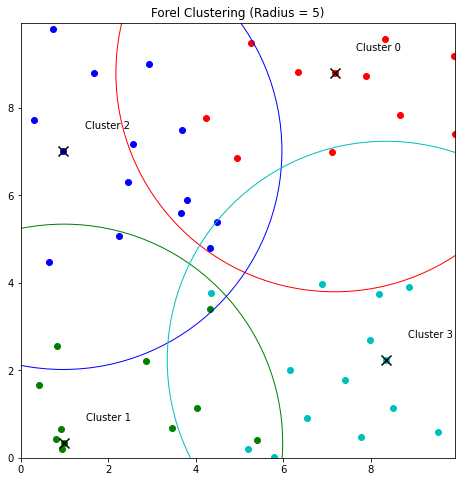
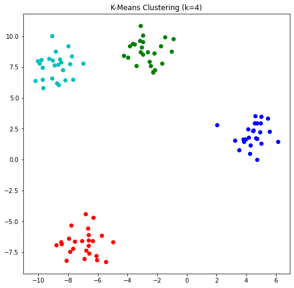

# Graph Clustering
### Description
graph_clusterize function, clusters input vectors using the Graph algorithm in NetworkX. It computes the pairwise distances between vectors and creates a graph by adding edges between vectors below the threshold distance. Clusters are then extracted as connected components of the graph. The function can also plot the graph and clusters if the draw parameter is set to True.

### Parameters
1. vectors: a list of input vectors to be clustered.
2. metric: distance metric to be used (default is Euclidean distance). It can take two values - 'euclidean' and 'cosine'.
3. threshold: distance threshold for considering two vectors to be in the same cluster.
4. draw (optional): a boolean value that determines whether to plot the results or not.
5. figsize (optional): a tuple that determines the size of the plot.
### Returns
A list of clusters, where each cluster is a list of vector indices.

### Note:
Experiment with different threshold value to get the desired result.
```python
from neulab.clusters import graph_clusterize

vectors = [
    np.array([25, 0]),  # 25-year-old female    #0
    np.array([35, 1]),  # 35-year-old male      #1  
    np.array([45, 0]),  # 45-year-old female    #2
    np.array([55, 1]),  # 55-year-old male      #3
    np.array([65, 0]),  # 65-year-old female    #4
    np.array([75, 1]),  # 75-year-old male      #5
    np.array([41, 1]),  # 41-year-old male      #6
    np.array([24, 0]),  # 24-year-old female    #7
    np.array([18, 0]),  # 18-year-old female    #8
    np.array([17, 1]),  # 17-year-old male      #9
]

clusters = graph_clusterize(vectors, metric='euclidean', threshold=20, draw=True, figsize=(10, 10))

Output:
clusters: [{0, 2, 4, 7, 8}, {1, 3, 5, 6, 9}]
```

# Minimum Spanning Tree Clustering
### Description
The mst_clusterize function clusters a list of input vectors using the minimum spanning tree algorithm in NetworkX.
The function first computes pairwise distances between vectors using the specified distance metric. It then creates a graph and adds edges between vectors based on distance. The function then computes the minimum spanning tree of the graph and extracts clusters as the num_clusters largest connected components of the graph.


### Parameters
1. vectors: list of input vectors to be clustered
2. num_clusters: number of clusters to form, default value is 2
3. metric (optional): distance metric to be used, default value is Euclidean distance
4. draw (optional): boolean value to plot the results, default value is False
5. figsize (optional): size of the plot, default value is (10, 10)
### Returns
A list of clusters, where each cluster is a list of vector indices
```python
from neulab.clusters import mst_clusterize

vectors = [
    np.array([18, 0]),  # 18-year-old female    #0
    np.array([33, 1]),  # 33-year-old male      #1  
    np.array([42, 1]),  # 42-year-old male      #2
    np.array([24, 0]),  # 24-year-old female    #3
    np.array([19, 2]),  # 19-year-old unknown   #4
    np.array([25, 2]),  # 25-year-old unknown   #5
]

clusters = mst_clusterize(vectors, num_clusters=3, metric='cosine', draw=True, figsize=(10, 10))

Output:
clusters: [{0, 3}, {1, 2}, {4, 5}]
```

# Forel Clustering
### Description
The algorithm works by initializing an empty list of centroids and an empty list of clusters. It then loops over all the vectors and checks whether each vector is within radius distance of any existing centroid. If it is not, the vector becomes a new centroid and a new cluster is created for it. If it is within radius distance of an existing centroid, the vector is assigned to the closest cluster.

The function returns a list of clusters, where each cluster is represented as a list of indices into the vectors list.

Note that the choice of radius can have a significant impact on the resulting clusters. If radius is too small, some vectors may not be assigned to any cluster. If radius is too large, all vectors may be assigned to a single cluster. It is often useful to experiment with different values of radius to find the one that produces the best clustering for a given dataset.
### Parameters
1. vectors: list of input vectors to be clustered
2. radius: distance of an existing centroid, the vector is assigned to the closest cluster.
3. draw (optional): a boolean value that determines whether to plot the results or not.
4. figsize (optional): size of the plot, default value is (10, 10)
### Returns
A list of clusters, where each cluster is a list of vector indices
```python
from neulab.clusters import forel_clusterize

vectors = [(random.uniform(0, 10), random.uniform(0, 10)) for _ in range(50)]

clusters = forel_clusterize(vectors=vectors, radius=5.0, draw=True)

Output:
clusters: a list of clusters
```

# Kmeans Clustering
### Description
The algorithm takes a list of vectors, the desired number of clusters (k), and an optional maximum number of iterations. It initializes the centroids randomly, and then alternates between assigning vectors to their closest centroid and updating the centroids to the means of their assigned vectors until convergence. The function returns the final list of clusters, where each cluster is a list of indices of the vectors assigned to it.
### Parameters
1. vectors: list of input vectors to be clustered
2. num_clusters: number of clusters to form, default value is 2
3. max_iterations: maximum number of iterations for convergence default value is 100
4. draw (optional): a boolean value that determines whether to plot the results or not.
5. figsize (optional): size of the plot, default value is (10, 10)
### Returns
A list of clusters, where each cluster is a list of vector indices
```python
from sklearn.datasets import make_blobs
from neulab.clusters import kmeans_clusterize

# Generate a random dataset
X, _ = make_blobs(n_samples=100, centers=4, random_state=42)

# Cluster the dataset using k-means with k=4
k = 4
clusters = kmeans_clusterize(vectors=X, num_clusters=k)

# Print the cluster assignments
for i, c in enumerate(clusters):
    print("Cluster {}: {}".format(i, c))

# Visualize the results
import matplotlib.pyplot as plt

fig, ax = plt.subplots(figsize=(8, 8))
colors = ['r', 'g', 'b', 'c', 'm', 'y', 'k']
for i, c in enumerate(clusters):
    color = colors[i % len(colors)]
    plt.scatter([X[j][0] for j in c], [X[j][1] for j in c], c=color)
plt.title('K-Means Clustering (k={})'.format(k))
plt.show()

Output:
Cluster 0: [6, 7, 8, 13, 17, 23, 24, 26, 31, 38, 39, 41, 49, 50, 51, 52, 58, 61, 68, 70, 80, 89, 90, 97, 99]
Cluster 1: [2, 9, 10, 14, 20, 25, 34, 35, 36, 37, 43, 44, 56, 57, 59, 73, 82, 84, 85, 86, 88, 92, 94, 95, 96]
Cluster 2: [1, 3, 5, 11, 12, 29, 30, 32, 42, 45, 46, 53, 60, 63, 66, 69, 71, 74, 76, 78, 79, 81, 87, 91, 93]
Cluster 3: [0, 4, 15, 16, 18, 19, 21, 22, 27, 28, 33, 40, 47, 48, 54, 55, 62, 64, 65, 67, 72, 75, 77, 83, 98]
```
