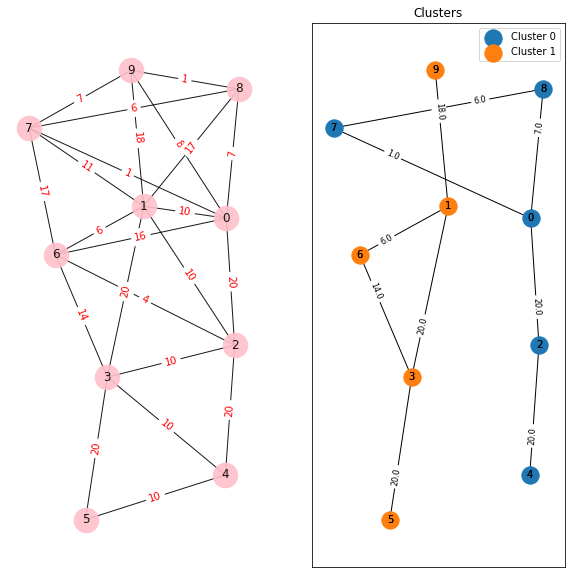

# Graph Clustering
### Description
graph_clusterize function, clusters input vectors using the Graph algorithm in NetworkX. It computes the pairwise distances between vectors and creates a graph by adding edges between vectors below the threshold distance. Clusters are then extracted as connected components of the graph. The function can also plot the graph and clusters if the draw parameter is set to True.

### Parameters
1. vectors: a list of input vectors to be clustered.
2. metric: distance metric to be used (default is Euclidean distance). It can take two values - 'euclidean' and 'cosine'.
3. threshold: distance threshold for considering two vectors to be in the same cluster.
4. draw: a boolean value that determines whether to plot the results or not.
5. figsize: a tuple that determines the size of the plot.
### Returns
A list of clusters, where each cluster is a list of vector indices.

### Note:
Experiment with different threshold value to get the desired result.
```python
from neulab.clusters import graph_clusterize

vectors = [
    np.array([25, 0]),  # 25-year-old female    #0
    np.array([35, 1]),  # 35-year-old male      #1  
    np.array([45, 0]),  # 45-year-old female    #2
    np.array([55, 1]),  # 55-year-old male      #3
    np.array([65, 0]),  # 65-year-old female    #4
    np.array([75, 1]),  # 75-year-old male      #5
    np.array([41, 1]),  # 41-year-old male      #6
    np.array([24, 0]),  # 24-year-old female    #7
    np.array([18, 0]),  # 18-year-old female    #8
    np.array([17, 1]),  # 17-year-old male      #9
]

clusters = graph_clusterize(vectors, metric='euclidean', threshold=20, draw=True, figsize=(10, 10))

Output:
clusters: [{0, 2, 4, 7, 8}, {1, 3, 5, 6, 9}]
```

# Minimum Spanning Tree Clustering
### Description
The mst_clusterize function clusters a list of input vectors using the minimum spanning tree algorithm in NetworkX.
The function first computes pairwise distances between vectors using the specified distance metric. It then creates a graph and adds edges between vectors based on distance. The function then computes the minimum spanning tree of the graph and extracts clusters as the num_clusters largest connected components of the graph.


### Parameters
1. vectors: list of input vectors to be clustered
2. num_clusters (optional): number of clusters to form, default value is 2
3. metric (optional): distance metric to be used, default value is Euclidean distance
4. draw (optional): boolean value to plot the results, default value is False
5. figsize (optional): size of the plot, default value is (10, 10)
### Returns
A list of clusters, where each cluster is a list of vector indices
```python
from neulab.clusters import mst_clusterize

vectors = [
    np.array([18, 0]),  # 18-year-old female    #0
    np.array([33, 1]),  # 33-year-old male      #1  
    np.array([42, 1]),  # 42-year-old male      #2
    np.array([24, 0]),  # 24-year-old female    #3
    np.array([19, 2]),  # 19-year-old unknown   #4
    np.array([25, 2]),  # 25-year-old unknown   #5
]

clusters = mst_clusterize(vectors, num_clusters=3, metric='cosine', draw=True, figsize=(10, 10))

Output:
clusters: [{0, 3}, {1, 2}, {4, 5}]
```